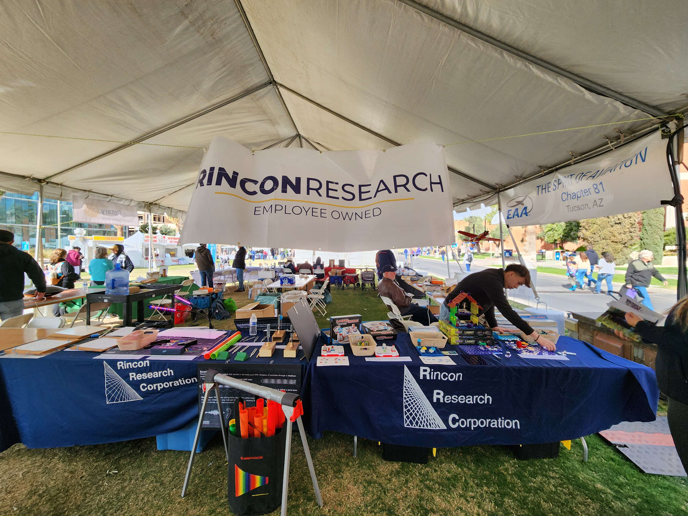

# THE TUCSON FESTIVAL OF BOOKS

/// info | Summary
    open: True

The Tucson Festival of Books was awesome! I had a blast even though it was pretty chilly.

It's also really fun and interesting when you run into people you haven't seen in years. 
///

---

At work I volunteered to represent the company at the Tucson Festival of Books. Although I've lived in Tucson most of my life, I've actually never been to the TFOB. So, I figured it would be a fun experience. I volunteered for the Saturday morning session with my coworker friend, Jay. 

I kept hearing about the TFOB every year, and I never really understood the appeal personally. To be fair, I had always been more of an indoors person, and I don't read as many books as I would like.

{ width="500" align=right }

Essentially, the TFOB is an event where famous and local authors come by and set up a tent to sell merchandise and sign autographs. Other than that it's sort of a cultural festival and you can try different cuisines and whatnot. My company in particular set up a booth in the Science City section of the TFOB, where people of all ages can learn about different concepts. 

This year we were in the Everyday Life section of the TFOB, so we taught kids about how waves play a role in everyday life. We had toys and puzzles that thematically covered geolocation, optics, sound waves, and circuits. It was interesting trying to simplify certain concepts such as direction of flow in a circuit. After all, these were mostly kids from the ages of 4 to 9.

I spent about three hours there, from 9AM to 12PM. Then afterwards I said my goodbyes to the rest of the crew manning the station and headed out. 

Overall, it was a good first time as an attendant *and* volunteer at the TFOB! I look forward to coming back just as an attendant sometime!