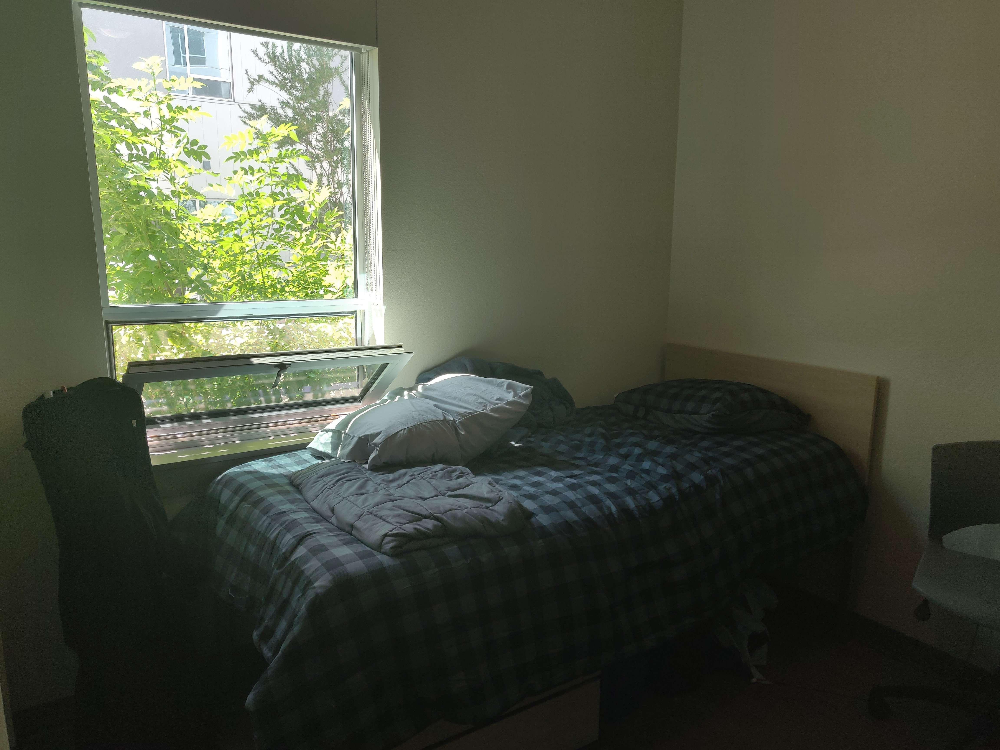

# MY WEIGHT LOSS JOURNEY

/// warn | Trigger Warning

This post discusses obesity and body image. If those topics are tough for you, take a moment to check in with yourself before reading. I share my story with respect for everyone’s journey, and my goal is to avoid unnecessary harm or judgment.
///

/// info | Summary
    open: True

Losing weight is hard—no surprise there. But what *did* surprise me was how much easier the process became when I started to work on my mindset, not just my body. By learning detachment, practicing acceptance, and becoming more self-aware, I slowly figured out how to turn my health around. This is my story.
///

---

# MY WEIGHT LOSS JOURNEY

## Introduction: From Fat Kid to Fat Adult

Growing up, I was always kind of the fat kid. For most of my childhood, it didn’t bother me much. I still had friends, I still had fun, and I didn’t think too hard about how I looked. It was just... life.

But things shifted when I hit around 15. That’s when I started to realize other people *noticed*—and not in a good way. Suddenly, I wasn’t just existing in my own little world. I was aware of how others saw me, and that awareness stuck with me like a shadow.

Being overweight as a kid? People joke about it. It’s “cute” or “quirky.” Being overweight in college? Not so much. Now you’re just “the fat guy.” It’s no longer endearing—it’s a problem people assume you should’ve solved by now.

And the truth is, I didn’t aspire to be unhealthy. I didn’t want to stay overweight. But I also didn’t fully grasp how damaging the lifestyle was—not just physically, but mentally and emotionally. What seemed like a minor issue at the time was laying the groundwork for years of struggle down the road.

---

## 2019-2020: The Fencing Arc

### A Chance Encounter

In Fall 2019, I started college at the University of Arizona, enrolling in the Honors College as a Computer Science student. Like a lot of people entering college, I wanted to "find myself." I didn’t go far—just about 30 minutes from home—but moving into the Honors Village dorm felt like a big step toward independence.

At the time, I was *not* athletic by any stretch. The last time I had played a sport was Little League back in 2008, and that had been short-lived. I wasn’t thinking about fitness; I was thinking about getting good grades, surviving college, and maybe figuring out who I wanted to be.

One day, a classmate from high school invited me to go to the gym. He wasn’t super into working out either, but we figured, “Why not?” Plus, the gym was literally next door to the dorm. Low effort, low stakes.

What happened next was pure chance—and it changed everything. About five minutes into our workout, I noticed this guy walk into the gym carrying an oddly shaped bag. It was long, narrow, and bulky, like something was stuffed in there that *shouldn’t* be. I watched as he shifted the bag, and that’s when I saw it—a sword hilt poking out.

I was intrigued. I’d never seen someone casually carrying a sword into a gym before, so I did what any curious person would do: I followed him. He went through a set of double doors into the basketball court, past a massive curtain divider that awkwardly split the court in half. I kept following, and at the far end of the court, I saw a group of students stretching in a circle. At the center was a middle-aged guy giving instructions.

I approached him, and he introduced himself as **Jay Fowler**, the coach of the U of A Fencing Club. And just like that, without planning or even understanding what fencing *was*, I became a fencer.

---

### The Ups and Downs of Progress

.jpg){ align=right }

It would be nice to say that fencing changed my life in a clean, upward arc—that it was all gains, wins, and personal transformation. But life doesn’t work like that. Like most things, it was messy, unpredictable, and full of both victories and setbacks.

Still, things started to improve. I lost fat and got fitter—more than I ever had in my life. I started getting attention from the opposite sex and even went on dates (which felt surreal at the time). I was more confident, more social, and overall “happier”—at least on the surface.

But here’s the twist: I hadn’t really *grown*. Not on the inside. All the progress I made physically wasn’t matched by emotional or mental growth. I hadn’t developed discipline, resilience, or real motivation. I wasn’t making these positive choices because I was driven or determined—I was just... lucky.

- I *just happened* to have a roommate who cooked healthy meals and was generous enough to share.  
- I *just happened* to live steps away from the gym, making it effortless to show up for fencing practice.  
- I *just happened* to be broke enough that I couldn’t buy junk food, even if I wanted to binge.  
- I *just happened* to schedule fencing practice during the same time I’d normally do my hardest homework. So naturally, I “prioritized my health” instead.

It wasn’t discipline—it was convenience. It wasn’t determination—it was avoidance.

> I didn’t lose weight because I worked hard. I lost weight because it was easier *not* to fail.

And the worst part? I didn’t even realize it. At the time, I thought I was really *doing something*. But the truth is, I had the misfortune of getting exactly what I wanted, exactly when I wanted it—with none of the growth required to maintain it.

---

## 2020-2021: The COVID Arc

Then, as if the universe decided I was flying a little too high, COVID happened. Almost overnight, everything shut down. Classes went online, the gym closed, and the fencing club came to a screeching halt. It felt like someone had hit the “delete” button on my social life. All that progress? Gone—or at least, that’s how it felt.

I lost touch with most of the people I’d gotten to know. Sure, I still had a small group from high school who’d come to the same college, and a few classmates from fencing and CS, but everything else? Radio silence.

I was back in my childhood bedroom, trying to focus on Zoom lectures while surrounded by memories of who I *used* to be.

And then, I gained weight. Fast. Like, **really fast**. Within six months, I didn’t even recognize myself. The mirror felt like a stranger was staring back.

### The Environment Shift

The environment that had once *accidentally* set me up for success was gone. There was no gym next door. No roommate cooking for me. No fencing practice conveniently scheduled during my hardest homework time.

I was left with just *me*. And I didn’t know how to handle that. I couldn’t bring myself to put in the effort to eat right or exercise. Everything felt hard. I’d sit at my desk for hours, scrolling, snacking, zoning out—completely disconnected from the version of myself that had once felt “in shape.”

It felt like I was made of kryptonite. Like the moment life got hard, I lost all my powers. All my healthy habits collapsed under the slightest pressure.

> I had become so used to life *conforming to me*, that when it didn’t, I froze. I couldn’t act. I couldn’t cope with resistance.

### A Hard Realization

That year taught me a painful truth: If you can only make good decisions *when life is easy*, you won’t make good decisions at all.

There’s a virtue in doing the right thing *especially when it’s hard*. That’s something I had completely missed—and I paid the price for it.

So I wallowed. I sulked. I numbed myself with comfort food and distractions.

And I waited—hoping for life to go back to normal so I could go back to being “healthy” without having to work for it. When they announced the return to in-person classes, I was beyond relieved. I thought, “Finally. I can fix this.” But it wasn’t that simple.

---

## 2021-2023: Junior and Senior Year

{ width="400" align=right }

Returning to campus didn’t solve everything. In fact, it hit harder than I expected.

Fencing was no longer held at the Honors Village gym. Instead, it had moved to a building on the *south* side of campus—far from where I lived. Suddenly, that effortless one-minute walk to practice became a 20-minute trek, and I just... didn’t go.

My dorm situation also sucked. I won’t go into detail, but let’s just say I had a rough roommate pairing that didn’t help my mental state.

On top of that, I got my first student job—long hours, stuck in a chair, no time to work out. No flexibility. No momentum.

### Silver Linings & Stagnation

Not everything was terrible, though. One of my suitemates became a great friend, someone I’m still close with today. That connection helped me stay afloat mentally, even when I felt like I was failing physically and emotionally.

But when it came to health, growth, and getting back on track? I didn’t make much progress. I never really got back into fencing. My academics were intense, and I was dealing with emotional baggage I hadn’t unpacked. Everything felt like too much.

Instead of facing it, I pointed fingers. I blamed my roommates. I blamed my job. I blamed the pandemic.

I convinced myself that the *world* was the reason I couldn’t get it together. And that mindset—the refusal to take ownership—followed me through the rest of college.

> I had a “failure to launch,” and instead of looking inward, I looked for excuses.

---

## 2023-2024: Adulthood and Awakening

In May 2023, I graduated with a degree in Computer Science. And I was *240-something pounds*.

Let’s be real—that crushed me. Not because of the number, but because of what it *represented*: Years of missed opportunities, avoidance, and a version of myself I no longer wanted to be.

I’d escaped the structured world of school, but now I had to face the unstructured reality of adulthood—and figure out who I actually was when no one else was setting the rules.

(continued...)

---

## 2024-Now: Deconstructing everything I had ever known about how to live a good life

Eventually, I became really frustrated with the way my life was going. 
How come I just *couldn't* change? 

I started consuming a lot of resources about weight loss, habit building, self-improvement, and all that jazz. 

After a while I came to a few realizations that fundamentally shaped the way I think about behavior and the art of bettering yourself

---

### The First Truth: The Nature of Motivation and Discipline
/// important | The First Realization
    open: True

---

Motivation is the ability to hold a thought in your head for a sustained period of time.
///

I'm not a neuroscientist or anything, but I have done a lot of reading on what separates successful and unsuccessful people. Some people say it's motivation, but that never really stuck right with me. After all, aren't homeless people really desperate to have a home?

I've found that it's easier to eat healthier if I simply sit there and imagine myself being healthy and eating the right foods. If I put myself in a situation where there's junkfood, I will naturally just think about junkfood more often that I think about healthy food. 

Meditation and prayer are foundational skills that I have been building lately. And they have been fundamental in evening out my mood and thoughts throughout the day. I find myself growing anxious less often, and existing at peace with the world more often. 

Also, fix your sleep schedule.

---

### The Second Truth: Pain Avoidance and Aggressive Reward-Seeking
/// important | The Second Realization
    open: True

---

If you have to get yourself in the mood to do XYZ. Then you will *only* be able to do XYZ when you're in the mood.
///

Most people try to approach self-improvement from a perspective of reducing the pain and increasing the incentive. You see this in ideas that get thrown around about "tricking yourself into wanting to work out", and stuff like that. 

This stems from a very weird western idea I've noticed, where people are obsessed with "taking what they want" and "leaving what they don't care for" out of literally everything in their life. Maybe it's a form of commodification? 

For years, I would try and get myself to go to the gym by "setting myself up" the night before. Leaving my gym clothes and shoes. I would try and seamlessly blend my showers into other parts of my life. I would "chore stack" to get stuff done as fast as possible. But I would just wake up the next day exhausted. I was really just living in constant "mood debt" to the next day. And then eventually that "debt" would get too big and I just wouldn't be able to do anything. Willpower and mind games can only go so far. The copium is real. 

Nobody actually "feels good" at the gym. Some people definitely derive pleasure from working out and knowing that they're doing something good for their body. But that's because they've *detached* themselves from the suffering of going to the gym. They still feel the pain and the buildup of lactic acid, but in their minds, it's as though there's a glass screen separating them. 

This idea of detachment is necessary for consistency. You do have to accept at a certain point that working out *will* suck, the physical discomfort and pain are there. And it won't go away until you stop working out. Even then, the next day you'll probably sore. Working out objectively sucks if you're not used to it. There's no easy way around it.

---

### The Third Truth: Awareness *Should* Precede Action
/// important | The Third Realization
    open: True

---

It's hard to know what *immediate action* to take if you don't regularly know where you stand. 
///

At the beginning of 2025, I started tracking my weight every morning. I'm aware that body weight fluctuates naturally because of water retention and whatnot. But it was still important for me to get into the habit of recording my weight, body fat percentage, body water percentage, skeletal mass, and muscle mass percentage. 

I wanted to be able to see the effects of water retention and muscle growth with as much granularity as possible because I'm a scientist and I like watching numbers go up and down and observing trends across long periods of time. 

Also, weighing yourself every day lets you observe those water weight and hormonal fluctuations in real time. Over time you'll develop an instict for how your body weight fluctuates, and you won't feel fat when you step on the scale the next day and see your weight changed. 

You learn to accept the fact that your weight naturally fluctuates and that that's okay. Because you see the fluctations within the context of the overall trend.

Regularly updating yourself on your progress/standing will bring a sense of *awareness* to your situation. And you will be able to *sustain the thought* of doing the right thing, the more aware you are of your standing relative to that ambition. 

This also allows you to make minor course corrections when you have to. Instead of waiting until you notice the weight gain and you have to go on some extreme diet.

---

### The Fourth Truth: The Nature of Sacrifice and Surrender
/// important | The Fourth Realization
    open: True

---

"You" will "never" benefit from "your" sacrifices.
///

So what the hell does that mean?

Imagine your professor gives you three weeks to do an assignment. And you goof off for three weeks straight, and you try and cram the whole thing in the final night. 

What just happened there? You put off the inherent suffering in doing your homework, for later. You decided that you wouldn't go through the trouble right now. But you spent three weeks doing that. And now that it's the due date, you try and cram everything in the last five hours of the night. 

There you are at your desk, crying. Realizing that you won't be able to finish this assignment that's worth 20% of your grade. You will definitely never get an A now.

But wait, didn't you know this was going to happen? Didn't you *willingly* put off suffering for later? Why the heck are you complaining? You were so okay with the idea of doing the work later. 

Ah... I see... you aren't the same person who put off their work. In your perspective, you woke up on the last day with a pile of homework you are now *forced* to do. Whereas every other day you woke up with a pile of homework that you could simply push forwards.

*The "you" who put off their homework is **NOT** the same person who has to do it the next day*

Likewise, when you go to the gym to work out, you will never feel the benefits. You will only feel the pain and soreness today. Because by the time you're fit and lean, you will not be the same person who is in a position to make those sacrifices. 

Future you (who only exists in the future) is the only one who will benefit. Right now (in the future), future you has what you are working for. And if you want to wake up tomorrow in that future, you must abandon today for their sake. 

You have to abandon what you want today, and instead do what future you accomplished today. And make sure he was grateful tomorrow.
